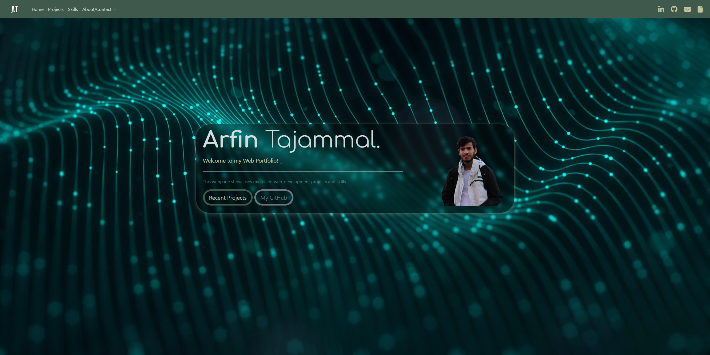

# Bootstrap-Portfolio

## Description

After Learning more advance HTML, CSS and Bootstrap, I have created a new Portfolio website. I have tried to build on the functionality from the previous Portfolio website and also enhance the User experience when navigating the webpage. As I do more projects and develop my skills I will add to this page.

Use the link below to access the deployed webpage:

https://arfinxx.github.io/Bootstrap-Portfolio/

This is the previous version of my Portfolio webpage:

https://arfinxx.github.io/Arfin-Portfolio/

## Usage 

This is what the webpage looks like on Desktop:

## License

MIT License in Repository